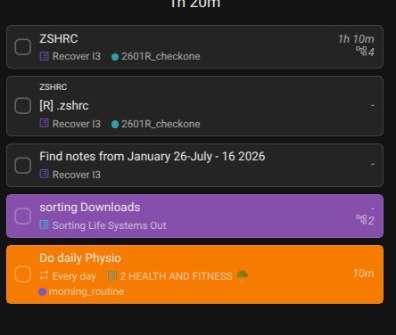

# Task Color Plugin for Super Productivity

Set background colors on tasks, with tag-based coloring, search/filter/sort in the side panel, a palette-style color picker with favorites/last-picked, and a task picker dialog for fast color assignment.

## Screenshot

## Installation

1. Download `task-color-plugin.zip`
2. Open **Super Productivity** → Settings → Plugins → Import Plugin
3. Select the zip file
4. Restart the app if prompted

## Usage

- **Side panel**: Opens automatically after import. Shows all tasks with their current color.
  - **Search**: filter tasks by title
  - **Filter**: All / Colored / Uncolored
  - **Sort**: Recent / By Color
  - **Clear**: click the swatch’s “×” to remove a color
- **Header button**: click the palette icon (or press `Ctrl+Shift+P`) to open the color picker for the current task
- **Task picker**: open the picker dialog to search and select any task by title/project/color
- **Tag colors**: assign a default background color to tags; tagged tasks inherit that color automatically
- **Colors persist** in synced plugin storage (`persistDataSynced`) so they survive sync and export. Existing colors stored in `task.notes` are automatically backported on first load.
- **Migrate button**: in the side panel, click **Settings** → **Migrate old tasks colors to Storage** to backport all legacy `task.notes` colors into synced storage and clean the notes marker from all tasks.

## How It Works

- Colors are primarily stored in synced plugin storage under the key `taskColors`.
- On first load, colors previously stored in `task.notes` under `__task_colors__=` are automatically backported into synced storage.
- The plugin hooks `CURRENT_TASK_CHANGE` and `ANY_TASK_UPDATE` to refresh colors automatically.
- DOM coloring runs in `plugin.js` (host-side) to survive Angular re-renders.
- Polling is limited to 5 seconds with a dirty-flag pattern to avoid excessive `getTasks()` calls.

## Caveats

### Board / Planner views

The app does not expose task IDs on `<planner-task>` elements in the board or planner tabs. The plugin uses a **title-text fallback** to color cards there.

| View | ID match | Fallback | Risk |
|---|---|---|---|
| Task list | `#t-<id>` | none | exact |
| Schedule | `schedule-event#t-<id>` | none | exact |
| Planner | `planner-task#t-<id>` | title text | may match multiple cards with similar titles |
| Board | `planner-task#t-<id>` | title text | may match multiple cards with similar titles |

**Impact**: In rare cases, two cards with the same or overlapping title may share a color. If you notice over-coloring, use unique task titles or rely on the task list/schedule views for precise coloring.

## Troubleshooting

- **Colors not showing in planner/board**: check the console for `[TaskColor] Title fallback matched X cards...` or `NO match`. If “NO match”, the title format in the DOM differs from `task.title`; open an issue with the task title and card text.
- **Picker does nothing**: check the console for `[TaskColor] Pick clicked...` logs; the dialog may not have captured a selection.
- **White text on light background in dark mode**: the plugin auto-adjusts text contrast; if it fails, the app theme classes may differ from the detected patterns.

## Files

- `manifest.json` — plugin metadata, permissions, hooks
- `plugin.js` — host-side logic, DOM coloring, dialogs, persistence
- `index.html` — iframe-side side panel UI
- `task-color-plugin.zip` — packaged plugin archive

## License

This project is licensed under the Cooperative Nonviolence License (CNVL) - see the [LICENSE](LICENSE) file for details.

## Support

If you find this plugin useful, please consider supporting its development:

